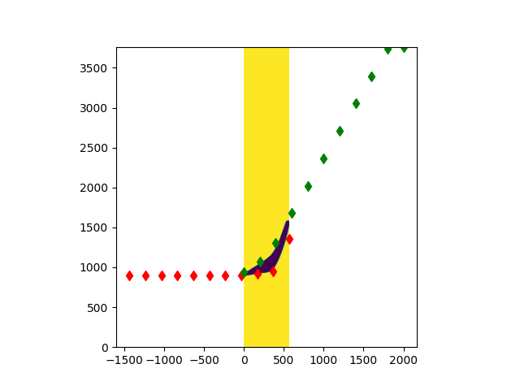
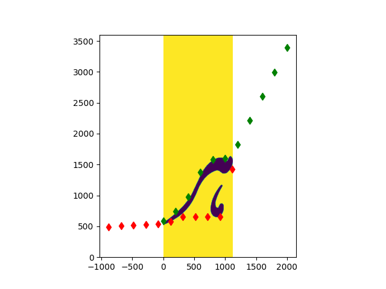
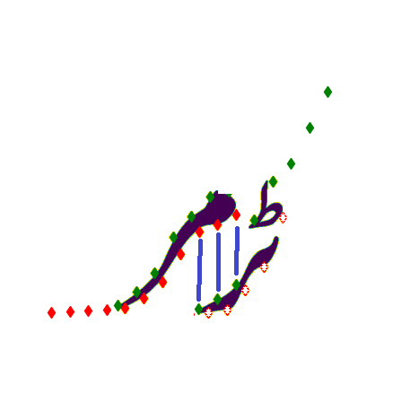

# Kerning
A Tool that provides automatic kerning for ligature based OpenType fonts in Microsoft Volt

There are three stages of the algorithm. 
- The first stage is to process every single glyph image and extract the extents of the strokes in terms of height at several horizontal locations. The output can be plotted by *plot_glyph_data* in module *heights*
 ``` python
import source.heights as ht
ht.plot_glyph_data(LookUp,"path/to/glyph.png","glyph")
```
LookUp is a dictionary that is output of the stage 1 processing:
``` python
import source.ligature_kerning as lk
lk.process_stage_1()
```
LookUp is automatically saved in obj/ folder after the stage processing finishes. 
- 
  Following are some examples of the output:
  
  
  
Red dots depict the bottom height of the glyph at a shift of 200 points. 
The green dots depict the same but from the top. 
The idea to check if any two glyphs would fit over each other for X amount of shift? Once the red dots from the left glyph can fit on top of the green dots of the right glyph, the kerning is possibble.
Example: In the following example the two glyphs show can kern by 600 (3*200) units. 

- The second stage of processing is meant to calculate, for each 200 uints of horizontal shift how much glyphs will fit on top of it without collision. This data is stord is right collision list. Another scenario is caculate how many glyphs can this particular glyph fit on top of, for each shift of 200 uints. 
This part is most intensive calculation wise as it has O(N^2) complexity. 
- The last stage of processing is to form groups of glyphs based on collision data (output of stage 2) and the glyph height data (output of stage 1) in order to generate volt files (that can be used to implement kerning in OpenType fonts.)
# Prerequisites
**Development environment**

Latest versions of the following packages are recommended:
 - Python 3.6 or higher
 - NumPy
 - OpenCv
 - Matplotlib
 
**Glyph setup**

Ligatures/Glyphs should be contained in a base directory (e.g. C:/Ligatures) having the following sub-directories (in PNG format):
- *Ligatures_Regular* This directory contains all the multi character glyph e.g. sbb (سبب), slslo (سلسلہ), etc.
- *Haroof_Regular* This Directory contains all the haroof (alphabets) glyph images in PNG format
- *Symbols* This directory contains all the symbols like parenthesis, period, commas, etc. 
- *Ligatures_Kashida* This directory contains kasheeda (italicised or elongated) glyphs
- *Haroof_Kashida* This directory contains kasheeda alphabets

**Assumptions about input images**

We assume that the glyphs are 2048 upm and the PNG Images generated are 300 dpi. This setting roughly gives image height of ~750 pixels. 